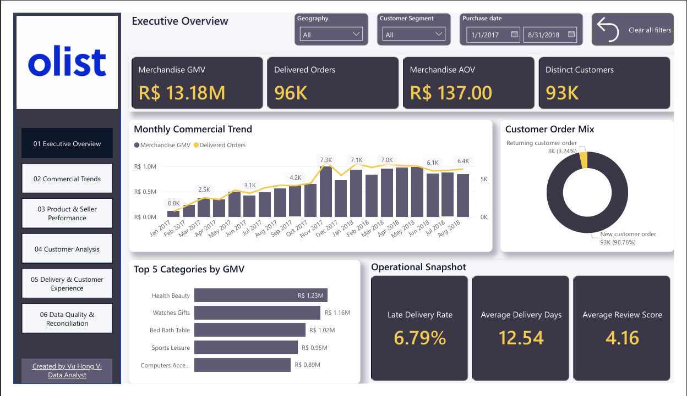
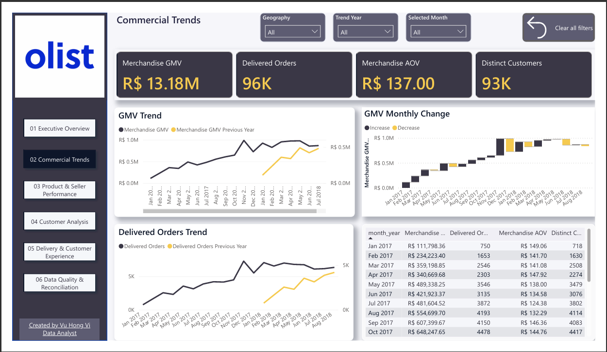
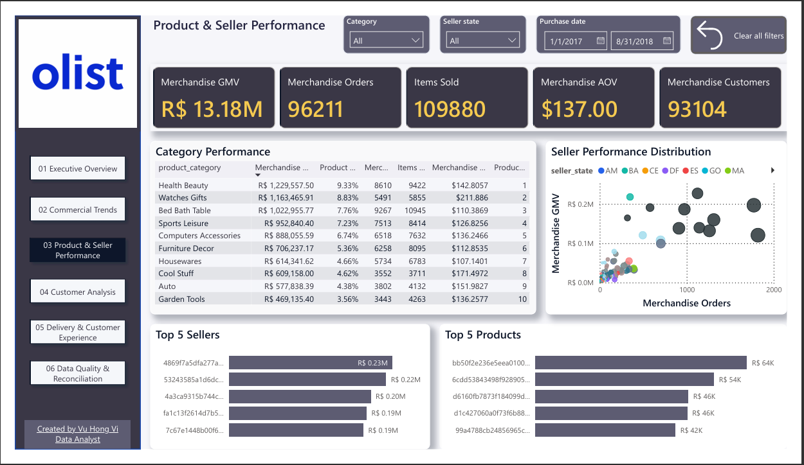
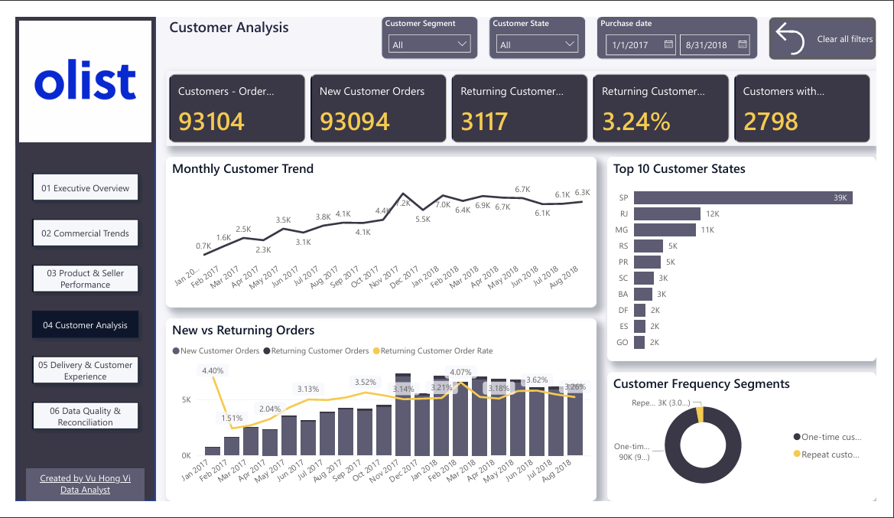
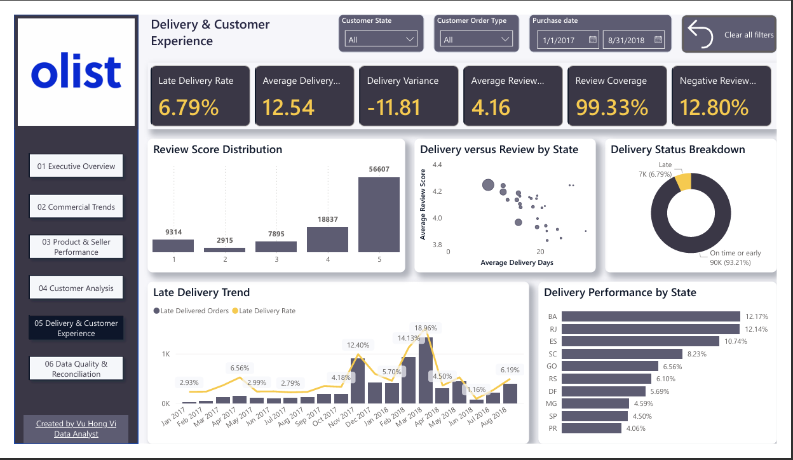
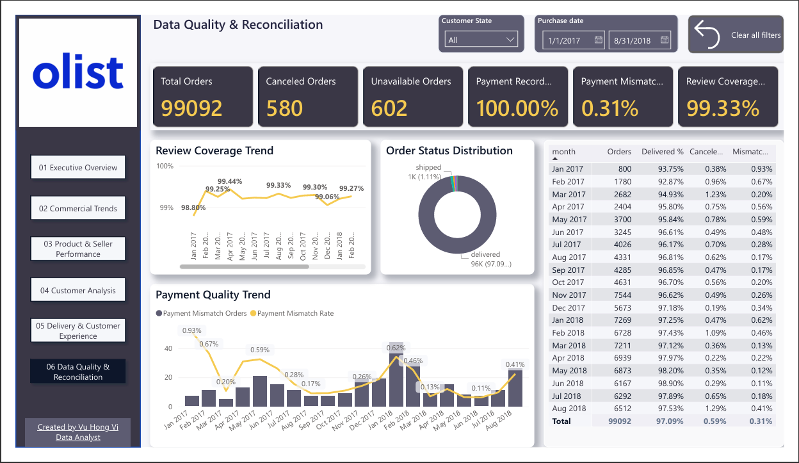

# E-commerce Performance Dashboard

A Power BI portfolio project that transforms the Brazilian E-Commerce Public Dataset by Olist into a decision-oriented marketplace performance dashboard.

The solution combines Power Query, dimensional modeling, DAX, and Python-based validation to analyze commercial performance, customer behavior, product and seller contribution, delivery operations, customer experience, and data quality.

## Dashboard Preview

[](docs/dashboard-pages/01_executive_overview.pdf)

> Click a dashboard image to open the corresponding PDF page. The Power BI file is available in [`powerbi/ecommerce_performance_dashboard.pbix`](powerbi/ecommerce_performance_dashboard.pbix).

## Project Status

**Completed**

- Source-data profiling and quality assessment
- Business-requirement definition
- Power Query transformation layer
- Dimensional semantic model
- Reusable DAX measure layer
- Six-page interactive Power BI dashboard
- Independent Python validation and financial reconciliation
- Dashboard PDF and PNG documentation

## Project Objective

This project demonstrates how multi-table e-commerce data can be transformed into a reliable Power BI analytical solution for a Marketplace Performance Manager.

The dashboard helps answer the following questions:

- How are Merchandise GMV, delivered orders, customers, and AOV changing over time?
- Which product categories, products, and sellers contribute the most marketplace value?
- How much activity comes from new versus returning customers?
- Which customer and seller regions drive performance?
- How frequently are deliveries late, and how does delivery performance vary by region?
- Is delivery performance associated with customer review scores?
- Are payment, review, and order-status records sufficiently complete and consistent?

## Reporting Scope

- **Primary reporting period:** January 1, 2017 to August 31, 2018
- **Commercial scope:** Delivered orders with order-item records
- **Customer identifier:** `customer_unique_id`
- **Merchandise GMV:** Sum of order-item price, excluding freight
- **Review selection:** Latest review retained for each order
- **Time comparisons:** Incomplete source periods excluded from the primary reporting window

Merchandise GMV represents marketplace merchandise value. It should not be interpreted as Olist's accounting revenue, commission income, gross profit, or net profit.

## Validated Results

The principal dashboard values were independently reconciled before report development.

| Metric | Validated value |
|---|---:|
| Merchandise GMV | R$13,181,027.13 |
| Delivered Orders | 96,211 |
| Distinct Customers | 93,104 |
| Items Sold | 109,880 |
| Freight Value | R$2,192,092.88 |
| Merchandise AOV | R$137.00 |
| New Customer Orders | 93,094 |
| Returning Customer Orders | 3,117 |
| Returning Order Rate | 3.24% |
| Customers with a Returning Order | 2,798 |
| Late Delivery Rate | 6.79% |
| Average Delivery Time | 12.54 days |
| Average Review Score | 4.16 / 5 |
| Review Coverage Rate | 99.33% |
| Payment Record Coverage Rate | 100.00% |
| Payment Mismatch Orders | 294 |
| Payment Mismatch Rate | 0.31% |

## Dashboard Pages

### 1. Executive Overview

Provides the main commercial KPIs, monthly commercial trend, leading product categories, customer order mix, and an operational snapshot.

[Open the Executive Overview PDF](docs/dashboard-pages/01_executive_overview.pdf)

### 2. Commercial Trends

Analyzes monthly GMV and delivered-order performance, prior-year comparisons, month-over-month GMV movement, and a monthly performance matrix.

[](docs/dashboard-pages/02_commercial_trends.pdf)

### 3. Product and Seller Performance

Evaluates category contribution, leading products and sellers, merchandise order volume, and seller performance distribution.

[](docs/dashboard-pages/03_product_seller_performance.pdf)

### 4. Customer Analysis

Examines customer volume, new and returning order behavior, returning-customer rate, customer frequency segments, and geographic distribution.

[](docs/dashboard-pages/04_customer_analysis.pdf)

### 5. Delivery and Customer Experience

Connects delivery timeliness with review behavior through delivery-status analysis, review-score distribution, state-level performance, and delivery-versus-review comparisons.

[](docs/dashboard-pages/05_delivery_customer_experience.pdf)

### 6. Data Quality and Reconciliation

Monitors order status, payment-record coverage, payment mismatches, review coverage, and monthly quality indicators.

[](docs/dashboard-pages/06_data_quality_reconciliation.pdf)

## Analytical Model

The semantic model separates order-grain and order-item-grain analysis to prevent duplicated values when combining products, payments, reviews, and orders.

### Fact tables

- `fct_orders`: One row per order for order status, customer, delivery, payment, and review analysis
- `fct_order_items`: One row per order item for merchandise, product, category, and seller analysis

### Dimension tables

- `dim_date`
- `dim_customer`
- `dim_product`
- `dim_seller`
- `dim_geography`

Relationships use one-to-many cardinality with single-direction filtering from dimensions to facts. No direct fact-to-fact relationship is used.

## Measure Layer

DAX measures are stored in a dedicated `_Measures` table and organized into display folders:

1. Core KPIs
2. Customer KPIs
3. Delivery KPIs
4. Customer Experience KPIs
5. Order and Payment Quality KPIs
6. Time Intelligence KPIs
7. Contribution KPIs

The measure layer includes current-period metrics, previous-month and previous-year comparisons, MoM and YoY change, contribution share, ranking, delivery quality, customer retention, and payment reconciliation.

## Data-Quality and Modeling Decisions

The source audit and validation process checks:

- Expected files and source row counts
- Primary-key and composite-key uniqueness
- Referential integrity between orders and child tables
- Missing values and timestamp consistency
- Review duplication and latest-review selection
- Payment totals versus merchandise plus freight
- Customer identity and repeat-purchase logic
- Reporting-period completeness

Important modeling decisions include:

- Use `customer_unique_id` instead of order-level `customer_id` for distinct-customer analysis.
- Keep Merchandise GMV and Freight Value as separate measures.
- Retain the latest review for each order to prevent duplicated review metrics.
- Calculate product and seller contribution from the order-item fact.
- Calculate order-status, delivery, payment, and review metrics from the order fact.
- Avoid many-to-many joins between items, payments, and reviews.
- Validate key dashboard totals independently with Python.

See [`docs/data_quality_report.md`](docs/data_quality_report.md) for detailed findings and treatment decisions.

## Dataset

This project uses the [Brazilian E-Commerce Public Dataset by Olist](https://www.kaggle.com/datasets/olistbr/brazilian-ecommerce).

- Publisher: Olist
- License: CC BY-NC-SA 4.0
- Source files: 9 CSV files
- Source purchase-date coverage: September 2016 to October 2018
- Primary dashboard period: January 2017 to August 2018

The complete dataset is not stored in this repository. See [`data/README.md`](data/README.md) for download, attribution, setup, and validation instructions.

## Technology

- Power BI Desktop
- Power Query
- DAX
- Python 3.11
- pandas
- Git and GitHub

Python is used for reproducible source validation and KPI reconciliation. Power Query and DAX are used for analytical transformation, semantic modeling, and report calculations.

## Repository Structure

```text
ecommerce-performance-dashboard/
|-- README.md
|-- .gitignore
|-- assets/
|   `-- images/
|       |-- 01_executive_overview.png
|       |-- 02_commercial_trends.png
|       |-- 03_product_seller_performance.png
|       |-- 04_customer_analysis.png
|       |-- 05_delivery_customer_experience.png
|       `-- 06_data_quality_reconciliation.png
|-- data/
|   |-- README.md
|   `-- sample/
|-- docs/
|   |-- business_requirements.md
|   |-- data_quality_report.md
|   `-- dashboard-pages/
|       |-- 01_executive_overview.pdf
|       |-- 02_commercial_trends.pdf
|       |-- 03_product_seller_performance.pdf
|       |-- 04_customer_analysis.pdf
|       |-- 05_delivery_customer_experience.pdf
|       `-- 06_data_quality_reconciliation.pdf
|-- powerbi/
|   `-- ecommerce_performance_dashboard.pbix
`-- validation/
    |-- requirements.txt
    `-- validate_source_data.py
```

## Reproduce the Source Validation

Install the validation dependency from the repository root:

```powershell
python -m pip install -r validation\requirements.txt
```

Run the validation script:

```powershell
python validation\validate_source_data.py `
    --data-dir "D:\path\to\olist_data"
```

Expected result:

```text
VALIDATION PASSED: all source and baseline checks succeeded.
```

## Documentation

- [Business Requirements](docs/business_requirements.md)
- [Data Quality Report](docs/data_quality_report.md)
- [Data Setup and Attribution](data/README.md)
- [Power BI Report](powerbi/ecommerce_performance_dashboard.pbix)

## Limitations

The dataset does not support reliable calculations for:

- Cost of goods sold
- Gross or net profit
- Marketing spend
- Customer acquisition cost
- Return on ad spend
- Inventory availability
- Refund value
- Customer demographics
- Olist accounting revenue

Unsupported financial, marketing, inventory, and demographic metrics are intentionally excluded.

## Author

**Vu Hong Vi**

Data Analyst

- GitHub: [VuHongVi](https://github.com/VuHongVi)
